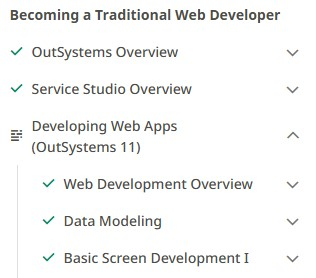

# Low-code Lab

This is my experimentation laboratory while learning about low-code development with the [OutSystems](https://outsystems.com) o11 platform.

There is a strong focus on testing, in all levels: unit, integration, and system (E2E). I use both opaque (a.k.a. black-box) and transparent (a.k.a. white-box) strategies. Unit and Integration Testing is done with OutSystems' BDD Frameworks, while E2E Testing is performed with [Playwrigth](https://playwright.dev).

The System Under Testing (SUT) is the application built in the online training journey [Becoming a Traditional Web Developer](https://learn.outsystems.com/training/journeys/traditional-web-developer-655). It is called OSMDb, OutSystems Movie Database, to manage movies and the people involved in them in different roles. You are encouraged to start this journey to develop your own version, but my latest version is available to be imported on your environment, if you prefer to skip the development effort.

## Setup

To use this repo you must have an account and environment in the OutSystems platform. For learning purposes, I recommend creating a personal account in the training website, but if you have an enterprise account, you can use it.

1. Go to https://learn.outsystems.com/training and sign up.
    * You will be given an environment to deploy your applications. Take not of this URL to use in step #5.
2. Download and install the [Service Studio](https://www.outsystems.com/downloads) desktop application, where all development and some testing takes place.
    * It is only available for Windows and Mac operating systems.
    * If you are on Linux, you may use a Windows virtual machine, which might be a bit slow, depending on your setup.
3. Download or clone this repo to a working folder.
4. In Visual Studio Code, install the [Playwright Test for VS Code](https://marketplace.visualstudio.com/items?itemName=ms-playwright.playwright) extension.
5. In the project root folder:
    * Run ```npm i``` to install Playwright and other packages.
    * Copy the file ```example.env``` to ```.env``` and replace the URL for ```os-env``` with the URL for your environment, created when you signed up.
6. If you do not want to develop your own applications, then in Service Studio, after logging in into your environment, use the menu option "Environment > Open Files..." to import both applications from the ```/os-apps``` folder.
    * If you are not familiar with web development in OutSystems, it is strongly recommended you watch at least up to the "Basic Screen Development I" module in that training course.
    
    

## Testing with BDD Frameworks

[Behavior-Driven Development (BDD)](https://cucumber.io/docs/bdd) is a powerful quality assurance (QA) and control (QC) technique that increases our chances to be both effective (critical thinking about requirements, business rules, acceptance criteria) and efficient (through test automation).

BDD is usually known due to the [Gerkhin language](https://cucumber.io/docs/gherkin/reference), but it is much more than writing your test scenarios with the Given/When/Then pattern.

OutSystems provides two BDD Frameworks out of the box:
* [BDD Framework Client Side](https://www.outsystems.com/forge/component-overview/10917/bddframework-client-side-o11), to test frontend interactions.
* [BDD Framework](https://www.outsystems.com/forge/component-overview/1201/bddframework-o11), to test backend interactions.

They require that the [OutSystems Architecture Canvas](https://success.outsystems.com/documentation/best_practices/architecture/designing_the_architecture_of_your_outsystems_applications/the_architecture_canvas) guidelines have been implemented, with the separated End-user, Core, and Foundation modules.

The following resources are recommended:
  * [Becoming a Tester in OutSystems](https://learn.outsystems.com/training/journeys/tester-654)
  * [A Complete Guide To BDD Testing in the OutSystems Low-Code Platform](https://www.outsystems.com/blog/posts/bdd-testing/)
  * [How to Automate BDD Testing in OutSystems, Part 1: An Introduction to the BDDFramework](https://medium.com/outsystems-engineering/tbd-569d67368bff)
  * [How to Automate BDD Testing in OutSystems, Part 2: The BDDFrameworks Test-Execution REST API](https://medium.com/outsystems-engineering/how-to-automate-bdd-testing-in-outsystems-part-2-the-bddframeworks-test-execution-rest-api-d7714c273ccd)
  * [How to Automate BDD Testing in OutSystems, Part 3: Data-Driven API Tests With the BDDFramework](https://medium.com/outsystems-engineering/data-driven-api-tests-bddframework-fbddca1dafaa)


## Testing with Playwright
To validate the application meets the intended user needs, a full E2E test is accomplished through Playwright, an increasingly popular testing framework by Microsoft.

This repo is essentially a Playwright project, which can be run:
* Via [CLI in terminal](https://playwright.dev/docs/test-cli).
* In [Text Explorer in Visual Studio Code](https://playwright.dev/docs/getting-started-vscode), provided you installed the extension in setup step #4 above.
